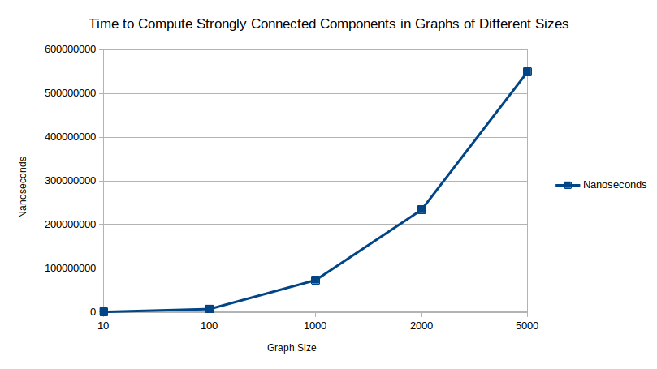

# GraphADT
### lukem1
### 12 November 2020

## Building and Running

This project can be built with the following command: `javac Main.java`

After compiling the program can be run using: `java Main`

The main class executes the required tests/computations and prints the results.

The program does not accept any command line arguments.

## Implementation Details

This implementation supports both directed and undirected graphs of various sizes.
An adjacency matrix was used as the underlying structure of this ADT.
The Graph class contains a constructor and various methods to interface with the adjacency matrix including methods for adding and deleting edges between two vertices as well as for performing a depth first search.

### 1: Creating Undirected Graphs of Various Sizes with |E| = (|V|(|V|-1))/2

There are two components which contribute to this functionality. First, the Graph constructor allows for a graph to be initialized as a complete graph, and second, the trimGraph() method in the Main class can be used on a complete graph to 'trim' edges from the graph until only 80% are remaining while ensuring that every vertex has at least one edge.

On my system the Graph class could support creating Graphs with up to approximately 40000 vertices before encountering fatal memory issues, these issues are described in detail and on a case by case basis in comments found in Main.java, but in short, creating graphs of such a large size demonstrates how scale can cause issues in even the simplest of programs.

### 2: Timing the Computation of Strongly Connected Components

This program includes an implementation of Kosaraju's algorithm for computing the strongly connected components of a graph using Depth First Search.

The text defines a version of this algorithm as follows:

```
Step 1 Perform a DFS traversal of the digraph given and number its
vertices in the order they become dead ends.

Step 2 Reverse the directions of all the edges of the digraph.

Step 3 Perform a DFS traversal of the new digraph by starting (and, if necessary, restarting) the traversal at the highest numbered vertex among still unvisited vertices.

The strongly connected components are exactly the vertices of the DFS
trees obtained during the last traversal
```

Clearly, in order to implement this algorithm and implementation of DFS was also required, so a recursive DFS method was created at this point.

It is important to note that the recursive implementation of DFS leads to additional memory problems when dealing with large graphs due to the sheer volume of recursive calls required. This could be improved by using a non-recursive algorithm to perform DFS, but as this assignment seems to be focused on exposing issues like this, I thought it was fitting to keep the recursive method.

The main method uses the findSCComponents() method to compute the SCCs of the graphs created in part 1. It is worth noting that it does not really make since to compute the SCCs of undirected graphs, as they only exist in digraphs, but since an undirected adjacency matrix can be treated as a directed graph, and we care more about the time the computation takes than the result itself, this detail doesn't really matter.

Unsurprisingly, the results demonstrate that larger graph sizes dramatically increase the cost of computing the SCCs of a graph. This can be seen in the graph below:



### 3: Enumerating Graphs and Creating Bipartite Graphs

The enumerate() method in the Main class enumerates the graph into two distinct sets using DFS.
Then, as the graphs from part 1 can by definition never be bipartite, a new complete and balanced bipartite graph is created using the subsets enumerated from the original graphs.
